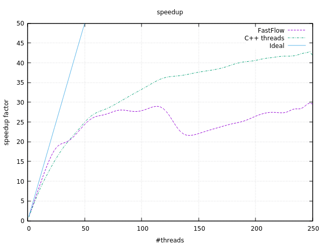
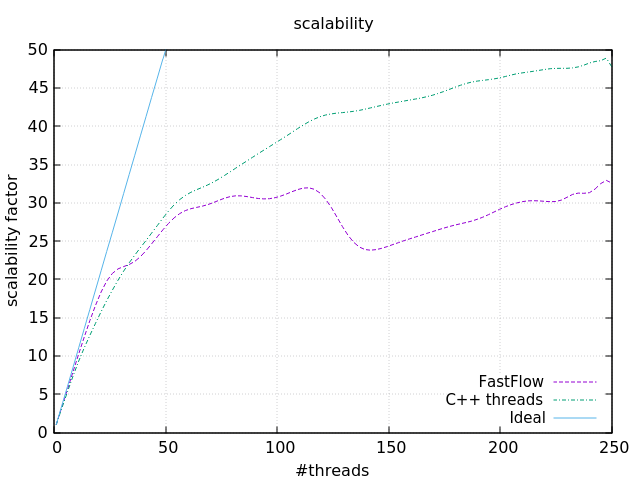

# TSPGeneticAlgorithm
The project consists in designing a parallel application
solving the TSP problem. Actually, i developed two applications, one using only the C++
threads (C++ STD and Pthreads only) and one using FastFlow.

## The problem
TSP is the well-known problem requiring finding the shortest path visiting just once all the nodes (cities)
in a graph. Graph arcs represents connections among cities (roads) and are marked with the distance in
between the source and destination city.
Genetic algorithms mimic genetic evolution of species. A set of chromosomes are defined and used to
simulate a given number of “generations”. Each generation is made by chromosomes deriving from parent
ones through cross-over or mutation. Cross-over takes two parent chromosomes and generates a
chromosome made by segments from either from parent A or from parent B corresponding positions.
Mutations randomly changes (or exchanges) positions in a single chromosome. Cross-over and mutations
occur with specific probabilities. A fitness function may be used to select the “best” chromosomes to
participate in the chromosome reproduction.

To solve the TSP, chromosomes should be lists of cities numbers representing possible paths. Cross-over
may be implemented picking up two random indexes in the list i and j with i<j and substituting the segment
from I to j in the first chromosome with the order list of cities not appearing in the resto of the first
chromosome taken from the second one in the order they are stored there. Mutation can be
implemented exchanging two random positions i and j in the chromosome. Fitness is the length of the
path represented in the chromosome.

## Getting Started

To build the project simply clone the repo and build it using the cmake file provided.


### Building
To generate the build system do:  
```
mkdir -p build
cd build
cmake ..
```
in the root of the cloned project.  

Now build the project:
```
cmake --build .
```

In both classes geneticAlgorithm and TSPGeneticAlgorithmST you can define the variable ```TIME``` and ```VALUES```.
In this way you can see in real time the time spent in each iteration and stage of the pipeline. 
Moreover, with ```VALUES``` you can see the current best chromosome value in the population.


### Running
The executable can be found in the ```build/``` directory. 
There are 4 executable file:
-  mainSeq : with it you can execute only the sequential version; 
-  mainST : with it you can execute only the C++ standard thread version; 
-  mainFF : with it you can execute only the FastFlow version; 
- main: with it you can execute all version at the same moment.
Just run it with:

```./build/${name_of_executable} numberOfNode population nIteration [nWorker] [seed] [crossoverProbability] [mutationProbability]``` 

E.g:
```./build/mainST 2000 20000 10 64 123``` 

All the variable between "[]" are optional.
Where the numberOfNode is the total number of nodes in the undirected graph.
Where the population is the total number of chromosome in the population.
Where the nIteration is the total number of iteration in the genetic algorithm.
Where the nWorker is the total number of worker(more precisely thread) that we would use, the default is 1.
Where the seed is the random seed that you would to use, the default is a random number.
Where the crossoverProbability is the probability that a chromosome is used in the crossover phase, the default is 0.2.
Where the mutationProbability is the probability that a chromosome is used in the mutation phase, the default is 0.1.

For both the probability you have to specify them like a double (e.g. 10% => 0.1).

## Results
The experience results are summarized in some plots that express the scalability and the speedup obtained running the code on the Xeon-phi machine.  
The benchmark depicts the scenario of 2000 nodes, 200000 chromosome population, . 

For the scenario I computed the execution time considering 1 up to 250 threads. Following are illustrated the plots with the metrics described. 






## Data and plot
In the folder "report" you can find the report.pdf file that explain what i have done in this project and shows some tests and results.
In the sub-folder "report/BenchMarkTSP" you can find the data used for the speedup and scalability plots.

### Plotting

To obtain the data used in the results shown you have to build the project.  
The three executables obtained must be put in a folder called ```build/``` in order for the ```script.sh``` script to work properly. These three executable should be called respectively ```mainSeq```, ```mainST``` and ```mainFF```.  

*To change the namings just edit the variables in *```script.sh```.

Running the script with ```./script.sh``` will generate the data for plotting in the folder ```plotting-and-data/data/```. To obtain the plots just open [Gnuplot](http://www.gnuplot.info/) in the folder ```report/BenchMarkTSP``` and load the scripts with

```load "<script-name.gp>"```

## Acknowledgments
This work was developed as final project of the course [Parallel and Distributed Systems](http://didawiki.di.unipi.it/doku.php/magistraleinformaticanetworking/spm/sdpm09support) at University of Pisa under the guide of [Prof. Marco Danelutto](http://calvados.di.unipi.it/paragroup/danelutto/) and [Prof. Massimo Torquati](http://calvados.di.unipi.it/paragroup/torquati/).
